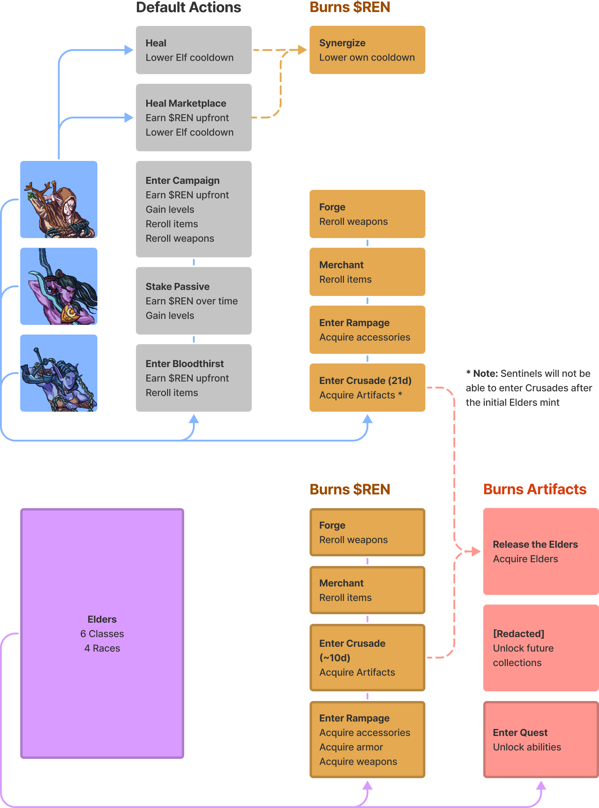

# Tokenomics

### **Miren ($REN)**

Miren is the bloodline of the Elves and powers the ecosystem of the Elven universe.

$REN the in-game utility token can be used to:

* Mint new [Sentinels](../elves/sentinels.md)
* Purchase in-game [items](../elves/items.md)
* Use in-game abilities
* Enter specific [game modes](../modes/game-modes.md)
* ...and more

Outside of the game, industrious players have setup a liquidity pool to freely swap $REN for ETH (or vice cersa). See the latest chart action on [Dextools](https://www.dextools.io/app/ether/pair-explorer/0xabb3611bd93cfb3a1e3b9bcf0cc1b3e910ccdb1d) or swap tokens on [Uniswap](https://app.uniswap.org/#/swap?outputCurrency=0xE6b055ABb1c40B6C0Bf3a4ae126b6B8dBE6C5F3f\&chain=mainnet).

### **Artifacts**

Artifacts are the spirit of the Elves which strengthens the Elven universe. With combination of Blood and Spirit, their world can rebuilt to be stronger than before.

Once the Elders are released, Artifacts can be used to:

* Mint new [Elders](../elves/elders-wip.md)
* Learn special abilities
* ...and unlock more in-game assets to come

### **Burning Mechanics**

Tokens are typically consumed for gameplay actions by Sentinels and Elders.

