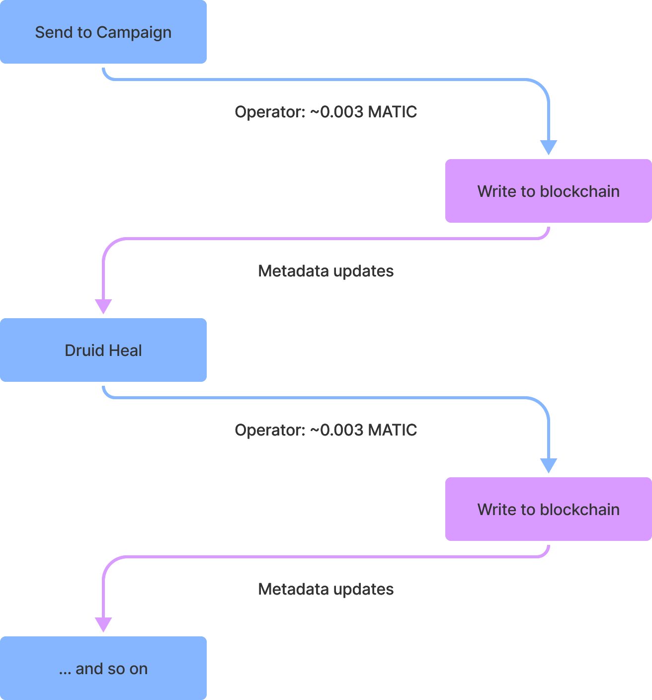

# Polygon Gameplay

Our Layer 2 Solution works by securely sending your Sentinel game state (DNA) between chains, Ethereum (L1) and Polygon (L2). This is achieved by only allowing a single operator to interact with the smart contract in Polygon, and by generating a single use signature to validate transactions back on Ethereum.

While your Elves are on Polygon, they are securely being held by our contract on Ethereum in a state of suspended animation. If you look up your Elf on the ETH view while it’s on Polygon you will see the last state it was in before the bridge.

When you bring assets back to ETH from Polygon, the DNA is transferred back into your Sentinel with the updated metadata.

Because the system is heavily dependent on the GUI, it is not possible to bridge out of Ethereum using the contract directly.

## **Bridging**

### Ethereum -> Polygon

1. Select _up to_ 10 Elves that are not in Passive staking or in cooldown
2. **\[Transfer]** Initiate the Elves you are sending
3. **\[Approve Transfer]** Approve the Ethereum transaction and pay the minor gas fee
4. **\[Confirm Transfers]** Opens the transfer website to see approved but pending bridges
5. **\[Confirm Transfers to Polygon]** Select up to 10 Elves to finalize the bridging process

### Polygon -> Ethereum

1. The steps are the nearly identical, except when the gas fee is paid


**Warning:** When bridging an NFT from Polygon back to Ethereum, you _must_ do an Action before initiating the bridge. If you do not do an Action, your NFT will get stuck.

The team will require an inconvenience tax of **10,000 $REN** to manually get the NFT unstuck (just kidding). But seriously, don't get your NFT stuck.


### Technical diagram











## **Gasless Transactions**

Gameplay on Polygon is free, courtesy of the Ethernal Elves team. The operator is loaded with $MATIC to pay for all gameplay transactions done on Polygon. This does not include transactions paid with $REN, which is the token that powers the Elven universe.


**Note:** Be patient with metadata updates as it may take up to 10 minutes to process on Polygon. If you notice there are no changes to your NFT, press the top center green button to reset and restart your browser.&#x20;




.png>)







## **Transaction Limit**

While inconvenient for those with many Elves, for the security and stability of the project and to ensure smooth gameplay for all, there is currently a limit of **10 NFTs per transaction**.

As gameplay progresses, this may change this in the future.
