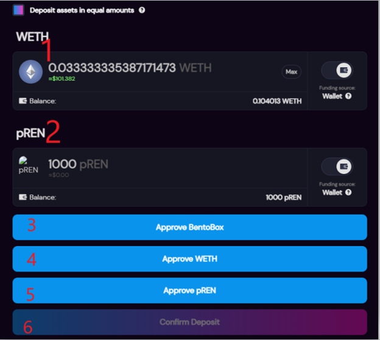

# Project Liquidity Pool FAQ's

## **Why a project owned Liquidity Pool?**

Protocol Owned Liquidity is a great way for projects to ensure the long-term success of their native assets.

When a project manages a Liquidity Pool, the project team can take certain actions to help keep the pool healthy. In the Ethernal Elves Project LP, we will lock up liquidity permanently. In return, the project will provide liquidity providers incentives.

When you provide liquidity to the project pool, you will receive[ SLP tokens (SushiSwap Liquidity Provider tokens)](https://docs.sushi.com/products/amm-exchange/liquidity-pools) which can be exchanged for $MOON.&#x20;

### LP Incentives&#x20;

#### **Receive $MOON in exchange for SLP** &#x20;

You can swap $SLP from the Project LP for $MOON using the Elven Wallet. The MOON per SLP will adjust based on the supply remaining, as per the bonding curve in the table below.&#x20;

<table><thead><tr><th>$MOON LP  Tier Supply</th><th align="center">$MOON LP Suply Remaining</th><th data-type="number">$MOON PER $SLP at Tier</th></tr></thead><tbody><tr><td>Tier 1: 300,000</td><td align="center"> 1,400,000</td><td>50</td></tr><tr><td>Tier 2: 300,000</td><td align="center"> 1,100,000</td><td>36</td></tr><tr><td>Tier 3: 300,000</td><td align="center"> 800,000</td><td>32</td></tr><tr><td>Tier 4: 300,000</td><td align="center"> 500,000</td><td>28</td></tr><tr><td>Tier 5: 50,000</td><td align="center"> 200,000</td><td>26</td></tr><tr><td>Tier 6: 50,000</td><td align="center">150,000</td><td>24</td></tr><tr><td>Tier 7: 50,000</td><td align="center">100,000</td><td>22</td></tr><tr><td>Tier 8: 50,000</td><td align="center">50,000</td><td>20</td></tr></tbody></table>

****

**What is $MOON and its utility?**

$MOON has the following utility

1. In-game use
2. Governance: Vote on future proposals
3. Receive a percentage of $REN burn through staking (details to follow)

Current In game use:

* Use 5 $MOON to reduce the cost of going on Crusades by 300 $REN per Crusade
* Use 15 $MOON to increase two (2) Artifacts probability by 10%

#### $MOON Supply:&#x20;

There will be a fixed supply of $MOON. When $MOON is used in-game, it will go back into Treasury, effectively removing it from circulation.

**Token Distribution**\
****LP Rewards: 1,400,000\
Treasury: 600,000\
Elders: 2,000,000

Total: 1,400,000

### **Why we are using Polygon?**

We are deploying the LP on Polygon for a few reasons, firstly, the game is expanding on Polygon so it would make sense to also have REN available on Polygon as pREN. Secondly, trading fees and gas on Polygon is much cheaper than on Eth, reducing our players costs. Finally, we are building an ecosystem of tokens managed through the Elven Wallet – it makes its simpler to manage.

### **Why should you provide liquidity?**

Providing permanent liquidity will help keep the pool healthy and create a sustainable game economy in the long term.

Currently, the only way to get $MOON is by providing liquidity and swapping your LP tokens (SLP) for $MOON


You can still provide liquidity without swapping it for $MOON. Rewards will be limited to fees earned from Sushi Swap and you can withdraw your liquidity at any time.&#x20;


## **How to bridge $REN from ETH to Polygon**

You can bridge REN that you have as a game credit or in your eth wallet, on Ethereum by first claiming REN to your wallet (if you have REN to claim) and then click **"SEND REN to GAME**". This will take 5 to 10 minutes to complete.


Do not attempt to bridge REN using the Polygon POS Bridge. Only use the dApp bridge as described above.


## **How do I provide liquidity?**

### **Step 1: Get pREN**

Make sure you have pREN in your wallet on Polygon. Go to the Elven Wallet, click approve (if doing this the first time) in the pREN token box. A web3 prompt will ask you to approve the contract to spend your pREN. This a one time approval will cost some gas and require you to be connected to Matic/Polygon.

After the approval completes, you should see two buttons, “To Game” and “To Wallet”.

&#x20;Click on To Wallet to withdraw pREN from your in game balance to your web3 wallet. Wait for about 30 seconds and then click on “Refresh Balance”. Proceed to step 2.

### **Step 2: Deploy Liquidity**

&#x20;Visit [WETH/pREN LP on Sushiswap](https://app.sushi.com/trident/add?tokens=0x7ceB23fD6bC0adD59E62ac25578270cFf1b9f619\&tokens=0xA2eCFEBe618E90608882c4aD6b3a2eA6FdEB5e46\&fee=30\&twap=false\&chainId=137), input an equal value of ETH and $REN. This link will show something like the following image, where assets can be added to the LP:

&#x20;

1. Enter the amount of WETH
2. Enter the amount of pREN equivalent
3. Approve BentoBox, this will prompt web3/Metamask for you to confirm
4. Approve WETH, this will prompt web3/Metamask for you to confirm
5. Approve pREN, this will prompt web3/Metamask for you to confirm
6. Confirm Despoit, this will prompt web3/Metamask for you to confirm and you will be redirected to the image below &#x20;
7. Review information and press Confirm Deposit.


Once the transaction is completed, you can review your transaction the blockchain


## **How do I swap SLP tokens for $MOON?**

Visit [www.app.ethernalelves.com/wallet](http://www.app.ethernalelves.com/wallet)

Look for the token labeled “SLP” and click on **Approve Contract** (if doing this for the first time)


This will be a one-time transaction on MATIC, from there transactions will be gasless as long as you approved your wallet on our GUI.


\
Once you click on approve, a web3 prompt will ask you to to reject or confirm.  Once you review the information and agree, click on confirm.

&#x20;&#x20;

Once it is confirmed, click on Swap. If the button does not change, wait for 30 seconds then click "Refresh Balances"

* Enter how many SLP tokens you wish to swap
* Review the current swap ratio for $MOON per SLP
* Read and agree to the terms
* Click “Confirm Swap LP for $MOON”

&#x20;
