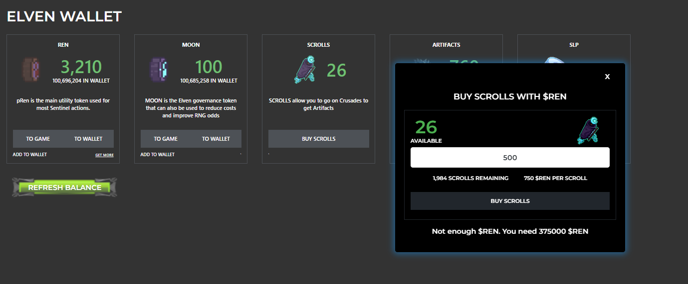

# Scrolls

###

Scrolls are parchments containing secrets, like recipes for crafting items, weapons, and armor. Scrolls may also contain the location of artifacts.

Scrolls were airdropped to existing holders leading up to the Awakening of The Elders. Scrolls may be purchased for REN from time to time through the Elven Wallet

**Purchase Scrolls**\
****Additional Scrolls will be available to purchase from May 9th 2022.  See the table below.&#x20;

| Scroll Supply    | $REN  |
| ---------------- | ----- |
| Tranche 1: 2,000 | 750   |
| Tranche 2: 2,000 | 1,500 |

&#x20;
