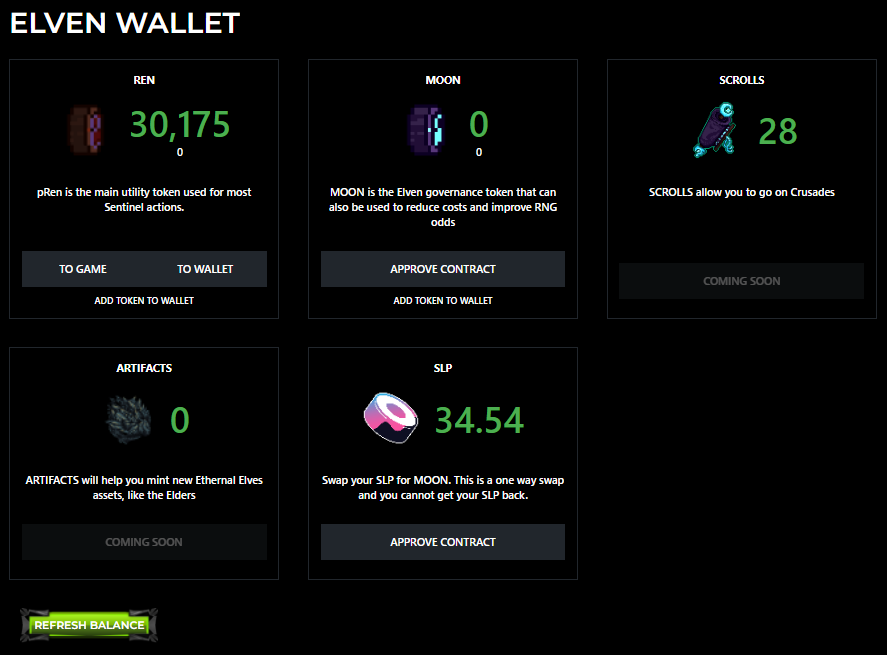

# The Elven Wallet

All in-game tokens, balances, and assets can be found in the Elven Wallet. To use any Ethernal Elves tokens in-game, you have to first transfer them to the game. We have built a simple interface to help you do this.

You can access the Elven Wallet by clicking on the hamburger menu in the top left corner.&#x20;



### Approve Contract

Before you can use the Elven Wallet to deposit or withdraw funds from your game balance, you need to approve the ElvenWallet contract to transact tokens on your behalf. You will have to do this for each token you want to use in the Elven Wallet.



You will need to be connected to Polygon/MATIC for approvals. Approvals require a small amount of MATIC.


### Deposit To Game

When you click on the "To Game" button, the contract will move tokens from your web3 eth compabible wallet (like Metamask) to your in game balance.


This is gasless! Once you have approved the contract, you do not need to pay for gas when you use the Elven Wallet again!


### Withdraw to Wallet

When you click on the "To Wallet" button, the contract will transfer tokens from your in-game balance in the Elven Wallet to your eth compabible wallet.&#x20;


This is a gasless transaction.&#x20;


### Add Token to Wallet

Clicking this button will add the token to your Metamask or web3 wallet.&#x20;

#### **Polygon Contracts**&#x20;

```
//BRIDGE 0xb33506b63382622cede7a44e5c2b08c5cb92224b6
//ELVES 0x4deab743f79b582c9b1d46b4af61a69477185dd5
//Wallet 0x87e8fbe53fa6c1900bcb8511124c65467e0e71bb
//pREN 0xA2eCFEBe618E90608882c4aD6b3a2eA6FdEB5e46
//Moon 0x6C183674Cf5948508f1ABb75c4AF2CAA0b1a9d81
//SLP 0x036b85e1f14c7e5cf9e80b6dc51bccda38c09242
```
