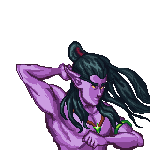

# Sentinels

Sentinels are the primary defenders of the homeland. They are found in four different races and can be one of three classes.

### Races

<mark style="background-color:blue;">Primebornes</mark> are direct descent of the Elders and the longest of the Bloodline.

<mark style="background-color:yellow;">Lightborne</mark> are a mixed race with Primeborne and a Human race.

<mark style="background-color:purple;">Darkbornes</mark> get their name as they were born in the Dark Ages and went through many wars.

<mark style="background-color:orange;">Woodbornes</mark> are a special breed as they have the spirit of animals.

### Stats

Sentinels improve over time and their stats are directly reflective of that.

The greatest impact stats have are on calculating [cooldowns ](cooldowns.md)for active game modes.

#### **Levels**

Leveling up gives Sentinels access to stronger [weapons](weapons.md) and harder [campaigns](../archived/campaigns.md).

#### Attack points

Attack points (AP) are used to calculate _attack time_ in the cooldown formula.

Equipping Sentinels with stronger weapons increases attack points.

#### Health points

Health points (HP) are used to calculate _regeneration time_ in the cooldown formula.

## Classes

### Druids

|  |  |  |  |
| --------------------------------- | -------------------------------------- | --------------------------------------- | -------------------------------------- |

Druids are filled with knowledge of the Ethernal Elves and have special abilities to assist Elves in battle. Without Druids, Elves wouldn't stand a chance against their foes.

#### Stats

$$
_{Druid}HP = \frac{Level}{3} + 22
$$

<table><thead><tr><th></th><th data-type="number">Min. Health Points</th><th data-type="number">Attack Points</th></tr></thead><tbody><tr><td>Lv. 1 (Tier 0)</td><td>22</td><td>2</td></tr><tr><td>Lv. 2-19 (Tier 1)</td><td>22</td><td>4</td></tr><tr><td>Lv. 20-39 (Tier 2)</td><td>28</td><td>6</td></tr><tr><td>Lv. 40-59 (Tier 3)</td><td>35</td><td>8</td></tr><tr><td>Lv. 60-79 (Tier 4)</td><td>42</td><td>10</td></tr><tr><td>Lv. 80-100 (Tier 5)</td><td>48</td><td>12</td></tr></tbody></table>

#### Ability: Heal

* Reduces cooldown for Assassins by 25% and Rangers by 50%
* Increases level by one
* 12 hour cooldown

#### Ability: Synergize

* Reduces own cooldown based on chance
  * 10% chance: 50% cooldown reduction
  * 60% chance: 33.33% cooldown reduction
  * 30% chance: 5 minute increase
* Requirements: 5 $REN, current cooldown to be 12 hours or less
* No cooldown

### Assassins

|  |  |  |  |
| ------------------------------------------ | ----------------------------------------- | ------------------------------------------ | ----------------------------------------- |

Assassins are hasty and hubristic, slashing through anyone that opposes the Elves. Not the most battle intelligent but the most balanced of them all.

#### Stats

$$
_{Assassin}HP = \frac{Level}{3} + 18
$$

<table><thead><tr><th></th><th data-type="number">Min. Health Points</th><th data-type="number">Attack Points</th></tr></thead><tbody><tr><td>Lv. 1 (Tier 0)</td><td>18</td><td>4</td></tr><tr><td>Lv. 2-19 (Tier 1)</td><td>18</td><td>6</td></tr><tr><td>Lv. 20-39 (Tier 2)</td><td>24</td><td>8</td></tr><tr><td>Lv. 40-59 (Tier 3)</td><td>31</td><td>10</td></tr><tr><td>Lv. 60-79 (Tier 4)</td><td>38</td><td>12</td></tr><tr><td>Lv. 80-100 (Tier 5)</td><td>44</td><td>14</td></tr></tbody></table>

#### Automatic Ability: Instant Kill

* Has a chance to instantly slay creatures, removing attack time from cooldown calculation
* [Bloodthirst](../sentinels-game-play/bloodthirst.md) only

### Rangers

|  |  |  |  |
| ---------------------------------------- | --------------------------------------- | ---------------------------------------- | --------------------------------------- |

Rangers are the most battle intellect, using their distances to deal immense damage upon their victims. Enemies always underestimate Rangers for their alluring beauty.

#### Stats

$$
_{Ranger}HP = \frac{Level}{3} + 14
$$

<table><thead><tr><th></th><th data-type="number">Min. Health Points</th><th data-type="number">Attack Points</th></tr></thead><tbody><tr><td>Lv. 1 (Tier 0)</td><td>14</td><td>6</td></tr><tr><td>Lv. 2-19 (Tier 1)</td><td>14</td><td>8</td></tr><tr><td>Lv. 20-39 (Tier 2)</td><td>20</td><td>10</td></tr><tr><td>Lv. 40-59 (Tier 3)</td><td>27</td><td>12</td></tr><tr><td>Lv. 60-79 (Tier 4)</td><td>34</td><td>14</td></tr><tr><td>Lv. 80-100 (Tier 5)</td><td>40</td><td>16</td></tr></tbody></table>

