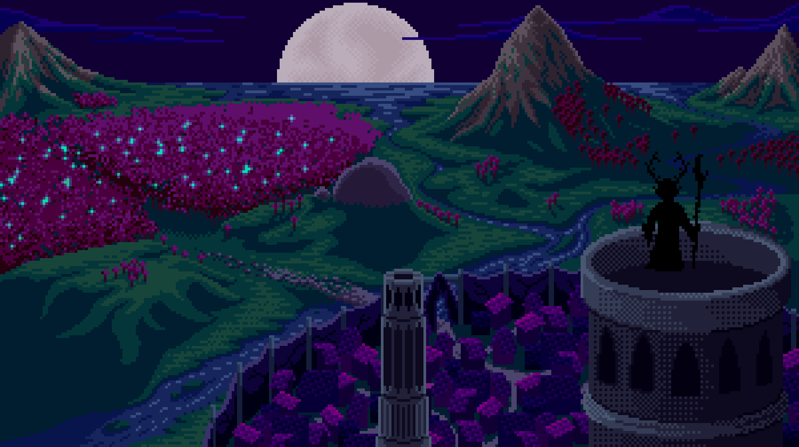
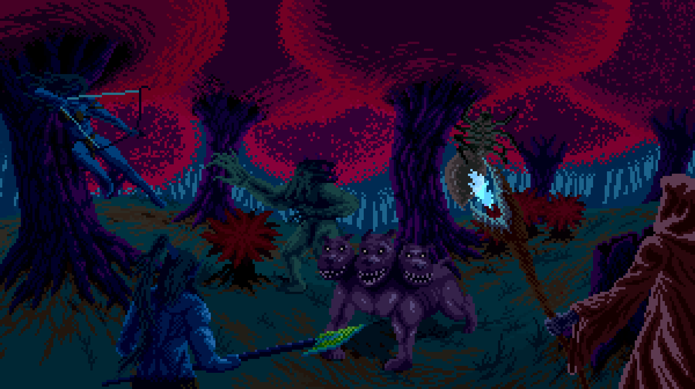
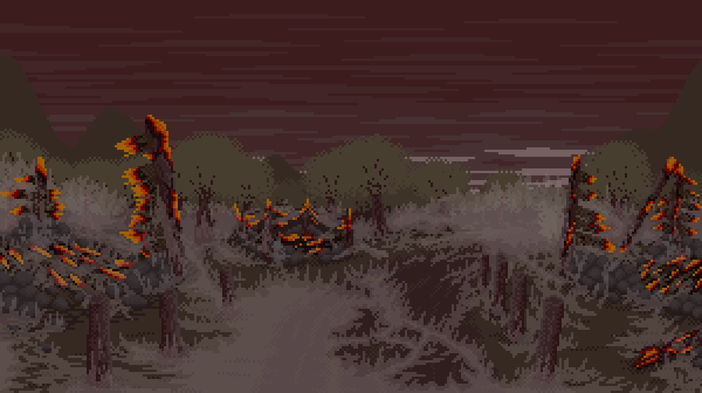

# Campaigns

Earn $REN upfront, find weapons, and level up for slaying creatures.

#### Sentinels:

* Enter a [cooldown period](../elves/cooldowns.md) after being sent to a campaign based on their stats
* Level up after being sent to a campaign
* Can reroll their weapon for free upon starting a campaign
* Can reroll their item for free upon starting a campaign
* Can consume their item upon starting a campaign

#### Each campaign campaign has:

* A limited supply of creatures to slay
* A minimum and maximum level of entry
* Five sectors that allow you to choose the relative $REN reward and health points of creatures

|                   | Starting Creature Supply | Min/Max Levels |
| ----------------- | ------------------------ | -------------- |
| Whispering Woods  | 6,000                    | 1–             |
| Enchanted Meadows | 3,000                    | 10–            |
| Mount Eluna       | 3,000                    | 20–            |
| Northern Fallout  | 15,000                   | 7–30           |
| Cove of Samim     | 15,000                   | 14–50          |
| Mammon's Lair     | 10,000                   | 30–100         |


**Note:** The only remaining creatures are in _Northern Fallout_ and _Cove of Samim_





Sentinels embark on a long journey to release the Elders. The Unknown has set creatures in the woods in attempt to stall Sentinels as long as possible. These creatures were no match and only empowered Sentinels to obtain enough Miren to grow the army that carries the bloodline...




Creatures are growing stronger but as Sentinels battle these creatures, weaponry is left behind and which allows them to continue the pace of battle. The tricks of the unknown in attempt to delay their path to the Elders is becoming ineffective...\





After days of Campaigns, the Sentinels grew close to the Elders home. Some have seen it with their own eyes before & some for the first time. Many Sentinels that arrived took a break but the ones that thirst for blood persisted...\





The next wave of Sentinels sneak across an eerily quiet land that can only be described as ravaged, littered with the remnants of the brave who came before them. A war occurred here, and it seems no enemy survived… until the ground rumbles with a thousand angry roars, and the creatures ascend. Starved for blood, unwilling to let any sentinel pass…




Sentinels arrived at an area where legends say the Son of Gaia himself fought many wars. As they enter, creatures block the passage way, fewer than we’ve seen before, more formidable, bodies mutated, faces scarred, sent by the unknown to block the sacred passage from entrance…



.png>)

The brave Sentinels pass through the passage into a dark lair, where they may finally collect remnants of the creatures that may strengthen them as they continue their journey toward the Elders… but there is a price to paid before entering as angry creatures swarm, driven mad with the thirst for blood…


