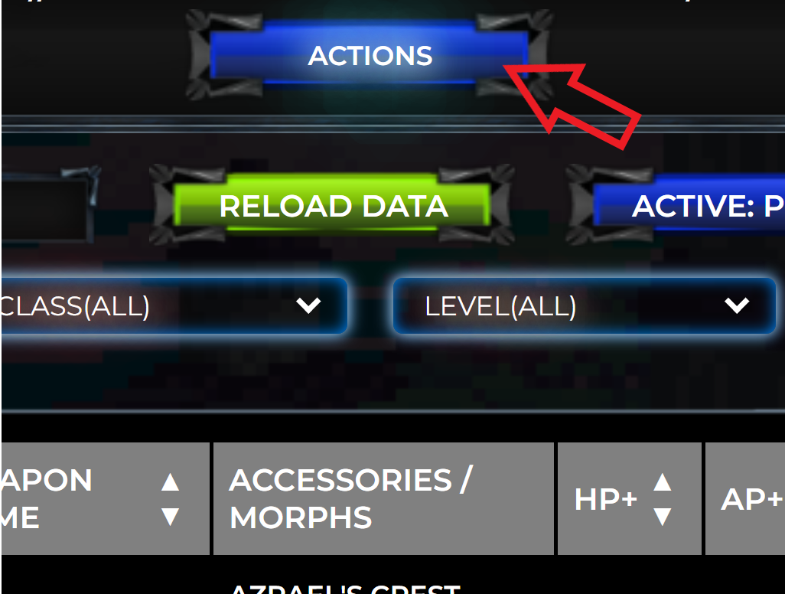
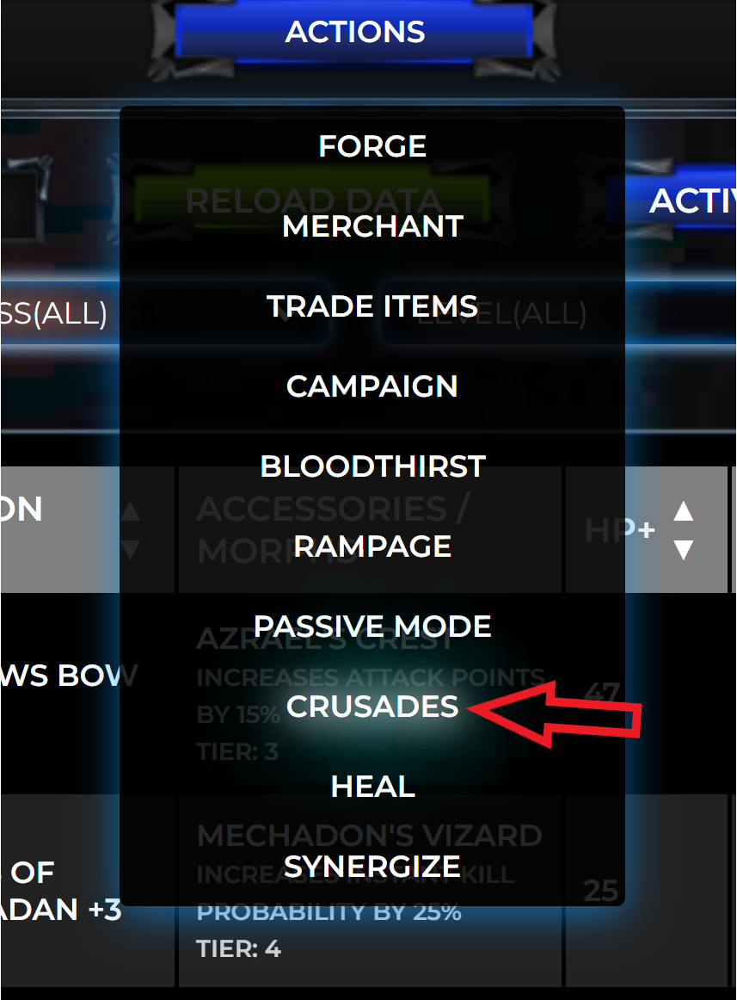
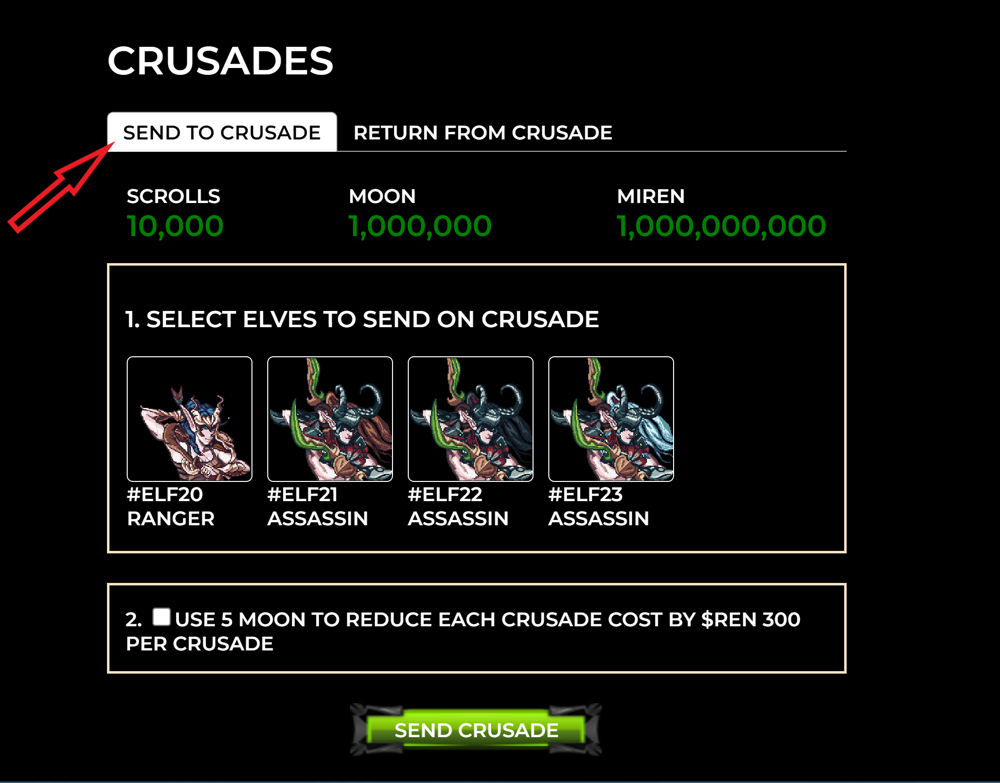
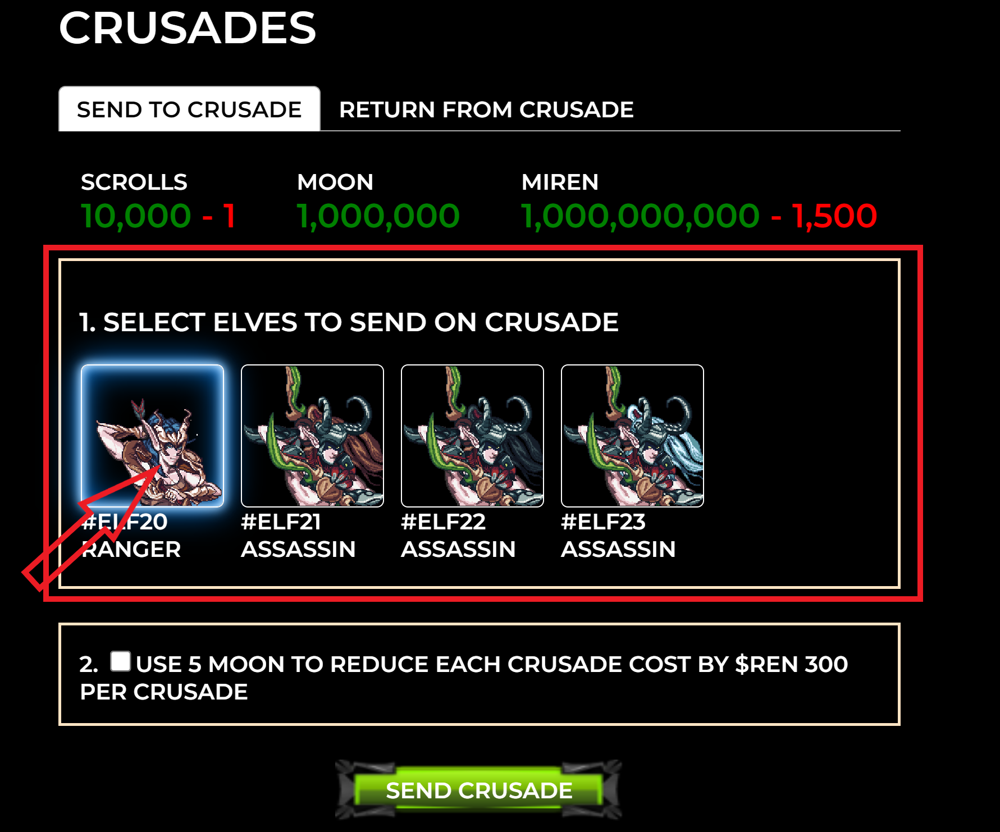
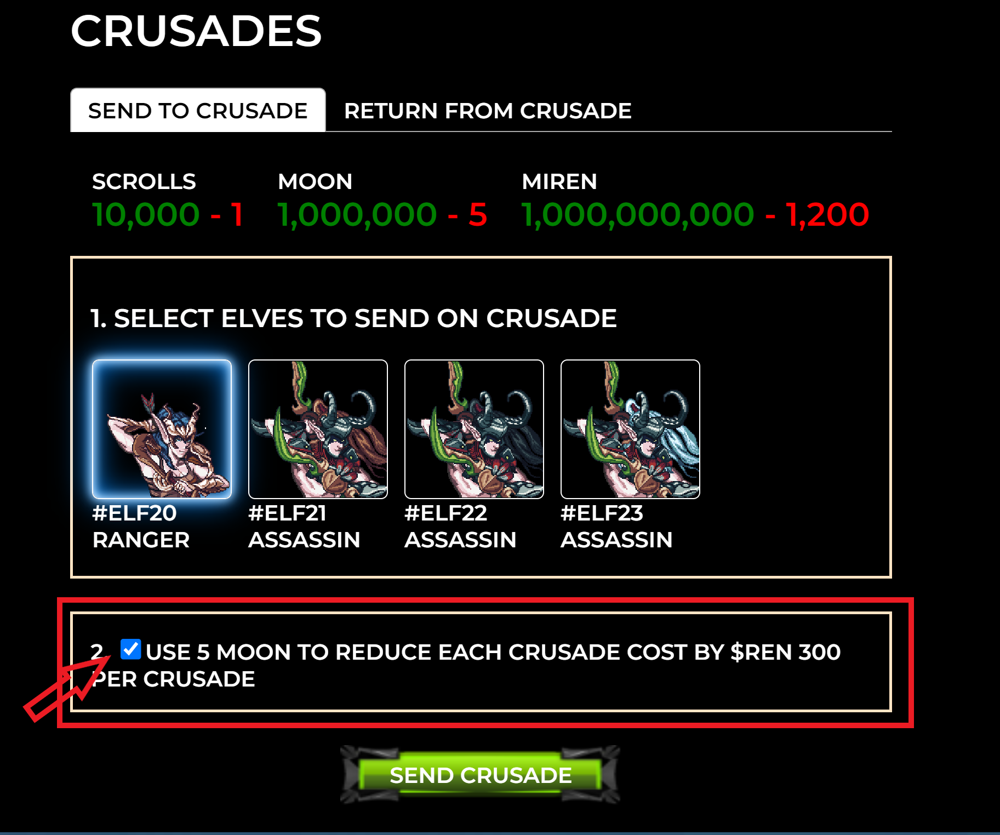
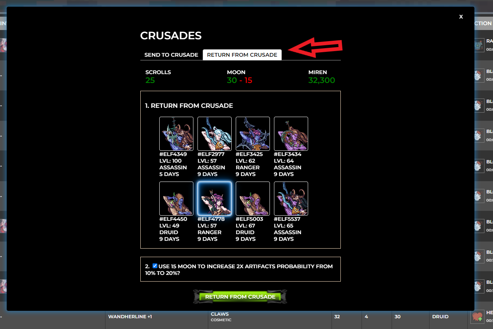

# Crusades

### **Sentinels**

\
With the sacrifice of $REN Sentinels will go on a long journey to acquire Artifacts.  Artifacts is a key component to releasing an Elder. Sentinels will need one Scroll to go on one Crusade.  Scrolls are not tradable and the amount received is determined by a stealth snapshot. If you have a Sentinel returning from a Crusade, you can send that Sentinel back out on a Crusade as long as that Sentinel has a Scroll.  \

### **Artifacts**&#x20;

\
Artifacts will be a tradable (ERC721) non-fungible token. In theory, even if you are not going on Crusades, you can purchase Artifacts on the secondary to mint an Elder.  During the initial supply of Elders, you will still need a Sentinel when you go to the summoning ground.  Sentinels will require 7 Artifacts to mint 1 Elder.&#x20;

Crusades will be completed "in-game" which is on Polygon.  You will need to bridge Artifacts to ETH like how you would bridge REN to ETH if you want to mint an Ethernal Elves NFT. &#x20;

The length of Crusades will depend on your level.  The amount of Artifacts received is fair for all Sentinels.  You will receive an Artifact **after** you completed the Crusade.\

### **$MOON Utility**

You can use $MOON to enhance Crusades by:

* Use 5 $MOON to reduce the cost of going on Crusades by 300 $REN per Crusade, when going on a Crusade
* Use 15 $MOON to increase two (2) Artifacts' probability by 10% when returning from a Crusade.

**How to use $MOON for Crusades**

When you go on Crusades, you will see two sections, with the headline Select Elves to send on Crusades&#x20;

You will notice a checkbox in each section above which you can then reduce the amount of $REN in section 1 or increase Artifacts probability in section 2.  Simply select the checkbox prior to clicking on **Send Crusade** or **Return from Crusades** if you want to use $MOON.


Note: You can do one $MOON enhancement at a time. You cannot reduce the REN cost more than once or increase the probability more than once per Crusade. You will be able to send multiple Elves and use $MOON in one TX.


### **How To Go on Crusades**

**Step 1:** Go to the Web App (dApp) on Gasless Gameplay.  Select Actions

**Step 2:** Dropdown will occur, select Crusades

**Step 3:**  Make sure **SEND TO CRUSADE** tab is selected

**Step 4:** Select your Elves, you will notice the amount of elves you select will reduce Scrolls and MIREN ( numbers are - in red)

**Step 5:** If you want to use $MOON, do not skip this step, select the checkmark if you want to use $MOON, leave unchecked if you do not want to use $MOON

**Final:** Review information and then click on **SEND CRUSADE** to confirm tx

### **How To Return From Crusades**

**Step 1:** Go to the Web App (dApp) on Gasless Gameplay.  Select Actions

**Step 2:** Dropdown will occur, select Crusades

**Step 3:**  Make sure **RETURN FROM CRUSADE** tab is selected

**Step 4:** Select your Elves you to RETURN

**Step 5:** If you want to use $MOON, do not skip this step, select the checkmark if you want to use $MOON, leave unchecked if you do not want to use $MOON. This step will increase the probability to receive two (2) Artifacts&#x20;

**Final:** Review information and then click on **RETURN CRUSADE** to confirm tx

### Overview

| Area              | 1 Artifact | 2 Artifacts | $REN  |
| ----------------- | ---------- | ----------- | ----- |
| Tartarean Crusade | 90%        | 10%         | 1,500 |

| Level        | Days |
| ------------ | ---- |
| Level 1-69   | 9    |
| Level 70-98  | 7    |
| Level 99-100 | 5    |

### **Initial Elders Mint**

There will be an initial mint date to mint Elders.  Even if you acquired enough Artifacts to mint an Elder, you will have to wait until the initial mint date.\
\
Initial Mint Date - Late May/Early June\
\
Elders Crusades will open up shortly after to acquire Artifacts and mint the remaining Elders.

**Approximate Mint Dates:** \
****Mint Artifacts:  May 16, 2022\
Mint Elders with Artifacts: June 3, 2022\
\
Elders Mint Price: 7 Artifacts\


Dates may come earlier, after the phase of Minting Elders with Artifacts occur. Elders will be able to acquire Resources to convert into Artifacts to Mint additional Elders

