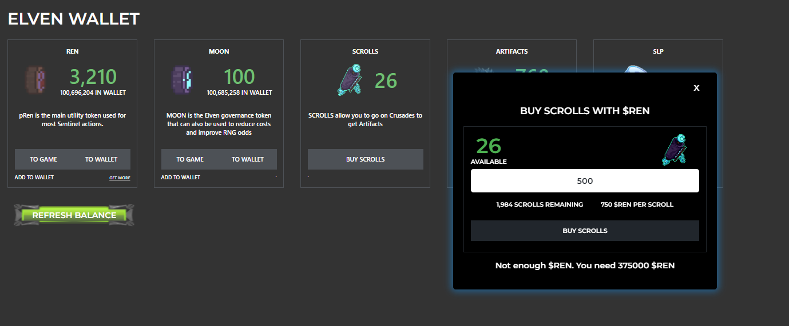

# Passive

Receive $REN after staking Sentinels for a certain amount of days.

#### Passive Mode Rewards

**Daly REN Rewards**

| Level Tier | Starting Level | Ending Level |
| ---------- | -------------- | ------------ |
| 1          | 1              | 20           |
| 2          | 21             | 40           |
| 3          | 41             | 60           |
| 4          | 61             | 80           |
| 5          | 81             | 100          |

#### If your Weapon Tier is 3 and you are level 100, you will earn \~24 $REN per day&#x20;

#### OLD  Rewards based on days staked:

(discontinued after May 9th, you will not be able to send any new transactions in Passive Mode.  However, you may return at any time.

| 0-6 days   | 0 $REN    |
| ---------- | --------- |
| 7-13 days  | 140 $REN  |
| 14-29 days | 420 $REN  |
| 30 days    | 1200 $REN |


**Note:** You do not accumulate $REN daily, but receive the reward after you Unstake

